# Linux Commands Lab Report

## Introduction

This lab introduces basic Linux operating system commands and helps in understanding how to interact with the system using the terminal. Linux is an open-source, Unix-like operating system used widely in servers, desktops, and embedded systems. Learning Linux commands is essential for system navigation, file management, and process control.

---

## Linux File System Structure

Linux follows a hierarchical file system structure starting from the root directory (`/`).

Common directories:
- `/` – Root directory
- `/bin` – Essential binary commands
- `/home` – User home directories
- `/etc` – Configuration files
- `/usr` – User programs and data

---

## Basic Linux Commands

1. `pwd` – Print Working Directory
When you open the terminal, you start in your home directory.  
The `pwd` command shows your exact location by displaying the absolute path from the root.

2. ls – List Files and Directories. The ls command is one of the most fundamental tools, used to display the contents (files and subdirectories) of the current working directory. If a directory path is provided as an argument, it lists the contents of that specified directory instead.
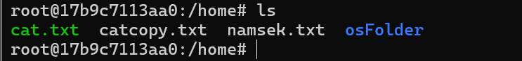

3. ls -a – Show Hidden Files. The -a (all) option modifies the default ls behavior. In Linux, files or directories starting with a dot (.) are considered hidden. This command ensures that all these normally invisible configuration files (like .bashrc or .config) are included in the list, along with the standard files
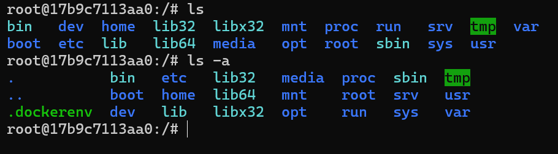

4. ls -l – (long listing format) option provides an extensive, detailed view of the files. The output includes crucial metadata such as the file type, file permissions (e.g., rwxr-xr-x), the number of hard links, the file owner, the group owner, the file size in bytes, the date and time of the last modification, and finally, the file name.
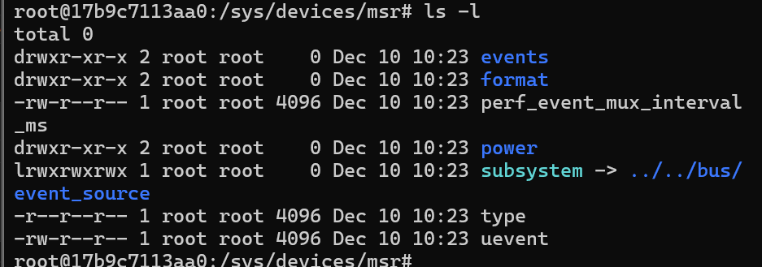
5. cd – The cd (change directory) command is used for navigation within the Linux file system hierarchy. You can use it with either an absolute path (starting from the root, like /home/user/Documents) or a relative path (relative to your current position, like Documents). Special arguments like .. move you up one directory level, and ~ (tilde) moves you directly to your home directory.

6. mkdir – The mkdir (make directory) command is used to create a new, empty directory (folder) in the location specified. If no location is specified, the new directory is created in the current working directory. You can also use options like -p to create a new directory and any necessary parent directories that don't already exist.

7. rmdir – Remove Empty Directory. The rmdir (remove directory) command is a simple, safe way to delete directories. However, it has a strict limitation: it can only delete a directory if it is completely empty. If the target directory contains any files or subdirectories, the command will fail, preventing accidental data loss.

8. rm – Remove Files. The rm (remove) command is used to permanently delete one or more files. It is an extremely powerful command because, unlike with graphical interfaces, deleted files are typically not sent to a trash bin; they are removed from the file system immediately. For this reason, it requires careful use.

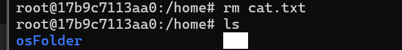

9. rm -r – Remove Directory with Files. The -r (recursive) option for the rm command is the necessary tool for deleting directories that are not empty. It recursively descends into the specified directory, deleting all files and subdirectories found within it, and then deletes the directory itself. Due to its power, confirmation prompts (like -i) are often recommended.

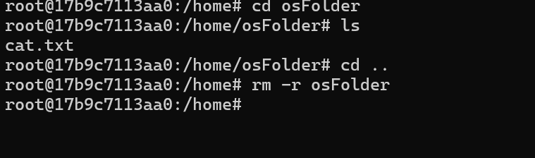

10. touch – Create File. The touch command primarily serves to update the timestamp (last modified date) of an existing file. However, if the specified file (new.txt in this case) does not exist, touch will create a new, empty file with that name. This makes it the quickest way to initialize a blank file.
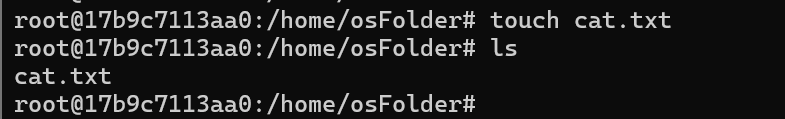

11. cat – Display File Content. The cat (concatenate) command is most commonly used to display the entire content of a file directly onto the terminal screen. It can also be used to combine the contents of multiple files or to create simple text files. If the file is very large, it can cause the screen to scroll rapidly, making the less or more commands more suitable for large files.

12. Text Editors (nano, vi, jed)
Text Editors. These are command-line based text editors that allow a user to create, modify, or view the contents of a file directly within the terminal window. nano is known for its simplicity and user-friendly on-screen prompts, making it ideal for beginners. vi (and its modern version, vim) is a modal editor that is extremely powerful and efficient for experienced users, often pre-installed on every Linux system.

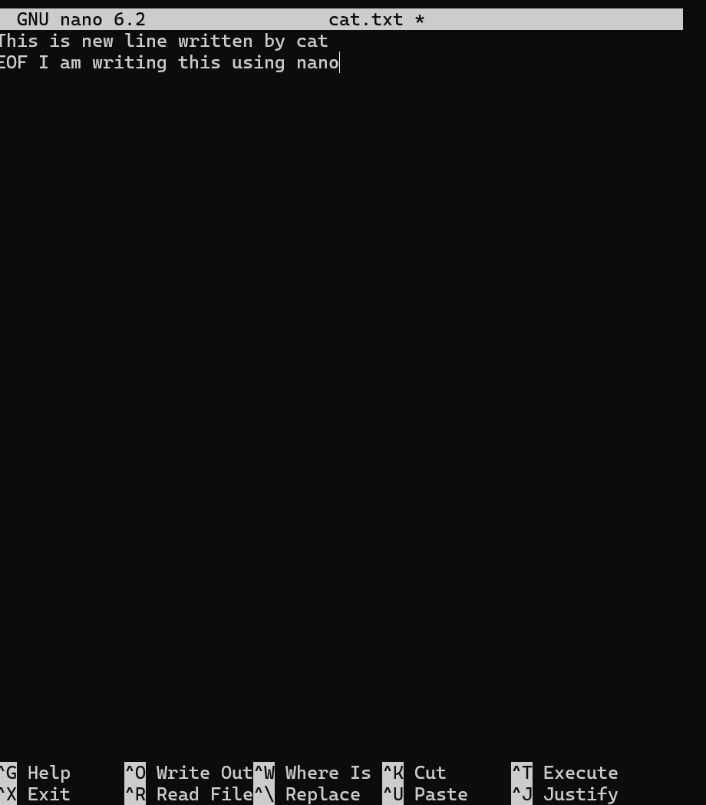

13. cp – Copy Files. The cp (copy) command copies a file or directory from a source location to a destination location. In the example cp a.txt b.txt, it creates a duplicate of a.txt and names the new copy b.txt in the same directory. It can also copy files to a different directory path.

14. mv –Move or Rename Files. The mv (move) command performs two distinct functions: it can relocate a file or directory from one location to another, or it can rename a file or directory within the same location. Unlike cp, the original file is deleted after the operation. For example, mv old_file.txt new_file.txt simply renames the file.

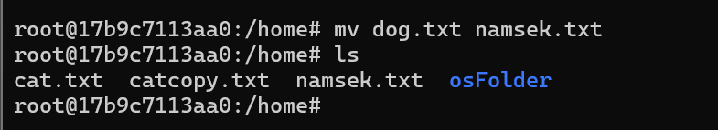

15. locate – Find Files. The locate command is a very fast tool used to find files anywhere on the file system. It works by querying a pre-built database (updated periodically by a program called updatedb) of all files, which makes it much faster than commands that search the file system directly (like find). However, it only knows about files that existed when the database was last updated.

16. echo – Print Text. The echo command is used to display a string of text or the value of a system variable (like $USER or $PATH) back to the terminal output. It is frequently used in shell scripts to provide output messages, or to redirect text into a file using the > operator (e.g., echo "Hello" > log.txt).

17. uname -a – System Information. The uname (Unix Name) command displays information about the operating system kernel. The -a (all) option provides a comprehensive output that includes the kernel name (Linux), the network node hostname, the kernel release number, the kernel version, the machine hardware name (architecture), and the operating system type.

18. df -h –Disk Usage. The df (disk free) command is used to display the amount of available and used disk space on the file system partitions. The crucial -h (human-readable) option automatically scales the output into easily understandable units like gigabytes (G) and megabytes (M), making it simple to assess storage capacity.

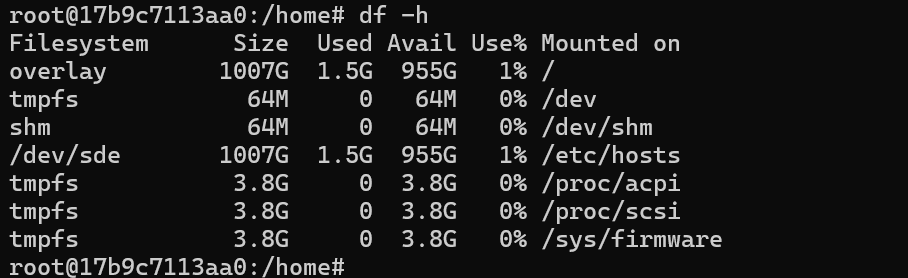

19. ps -u Show Processes. The ps (process status) command captures a snapshot of the currently running processes on the system. By using the -u $USER option, the output is filtered to show only those processes that are currently being executed by the current logged-in user, identified by the system variable $USER. This is often used for troubleshooting or monitoring resource usage.

20. top - Real-Time System Monitor. The top command provides a dynamic, real-time, and interactive view of system activity. It constantly updates the display with critical metrics, including CPU load, memory usage, swap usage, and a list of the most resource-intensive processes currently running, making it the primary tool for live system performance monitoring.

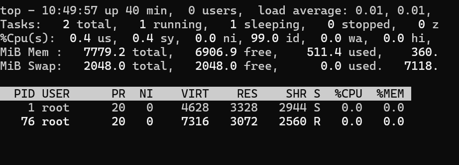

21. chmod: Change File Permissions. The chmod (change mode) command is used to modify the access permissions of files and directories. Permissions control who can read, write, or execute a file. The numbers (755 in the example, which is octal notation) represent the permissions for the Owner, Group, and Others respectively, following the specified meaning:

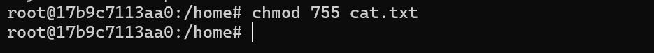
• 7 (Owner): Read, Write, Execute (rwx)

• 5 (Group): Read, Execute (r-x)

• 5 (Others): Read, Execute (r-x)

Conclusion

This lab helped in understanding basic Linux commands including file management, navigation, and system monitoring. These commands are essential for working efficiently with Linux-based systems.

Conclusion

This lab provided practical experience with essential Linux commands. These commands are fundamental for navigating, managing, and maintaining a Linux operating system efficiently.